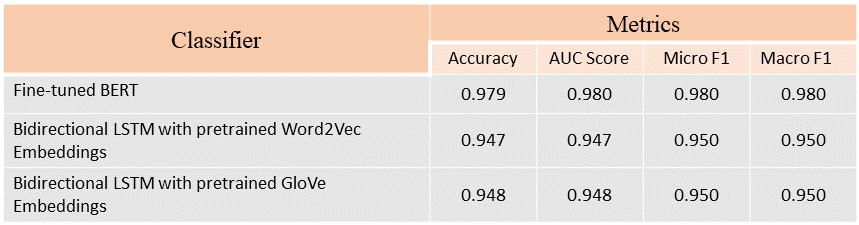

# Sarcasm-Detection

Using various NLP models for classifying sarcastic and non-sarcastic texts.


## Dataset

The dataset used for this project is taken from Kaggle (<a href = "https://www.kaggle.com/datasets/rmisra/news-headlines-dataset-for-sarcasm-detection">dataset</a>).

The dataset consists of approximately 55k records. Each record consists of three attributes:

* ```is_sarcastic```: 1 if the record is sarcastic otherwise 0

* ```headline```: the headline of the news article

* ```article_link```: link to the original news article


Majority of Sarcasm Detection studies make use of Twitter datasets which are collected using hashtag based supervision.

The downside of such datasets is that they are very noisy with respect to the language and the target label. 

Moreover, most tweets on Twitter are dependent on other tweets. Thus they have some inter-dependence. This begs the need of having context-dependent tweets for a given tweet. This is generally not feasible for platforms like Twitter which are flooded with enormous amounts of tweets daily.

The News Headlines dataset overcomes this issue of inter-dependence by collecting data from two independent sources. The data is less noisy and the texts are generally formal in nature.


## Results

The performance of various classifiers is shown below:




## Tech Stack

* Tensorflow
* Keras
* Hugging Face
* Gensim 

## Improvements

* Due to lack of computational resources, the base version of BERT uncased is used. Using the latest SOTA NLP models will help improve the performance further.
* Increasing the batch_size and the no. of epochs and playing around with model hyperparameters can also help improve the metrics.


## Feedback

If you have any feedbacks or queries, feel free to reach me out at: aaryan.nakhat@gmail.com

If you would like to connect/collobrate with me, do ping me up on Linkedln: <a href = "https://www.linkedin.com/in/aaryan-nak" target="_blank">Aaryan Nakhat</a>
